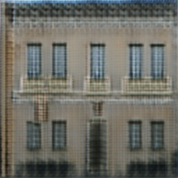
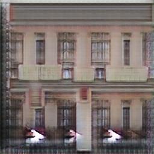
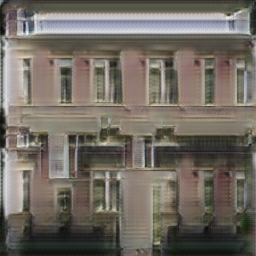
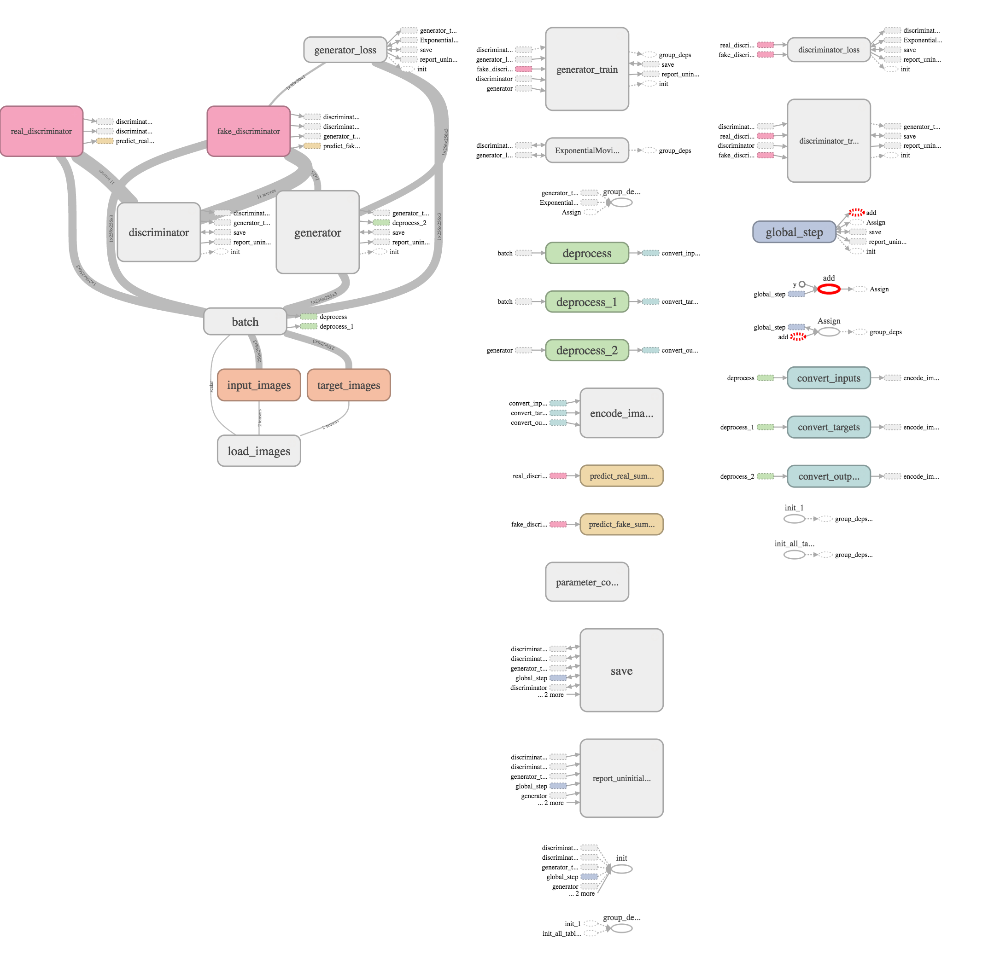
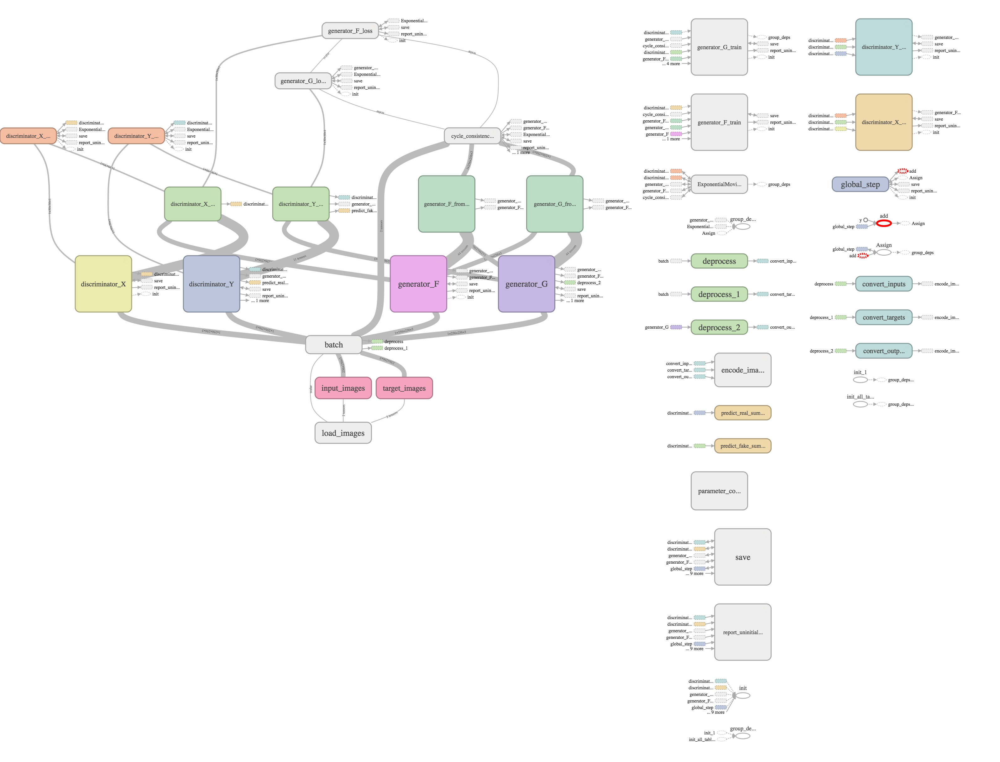
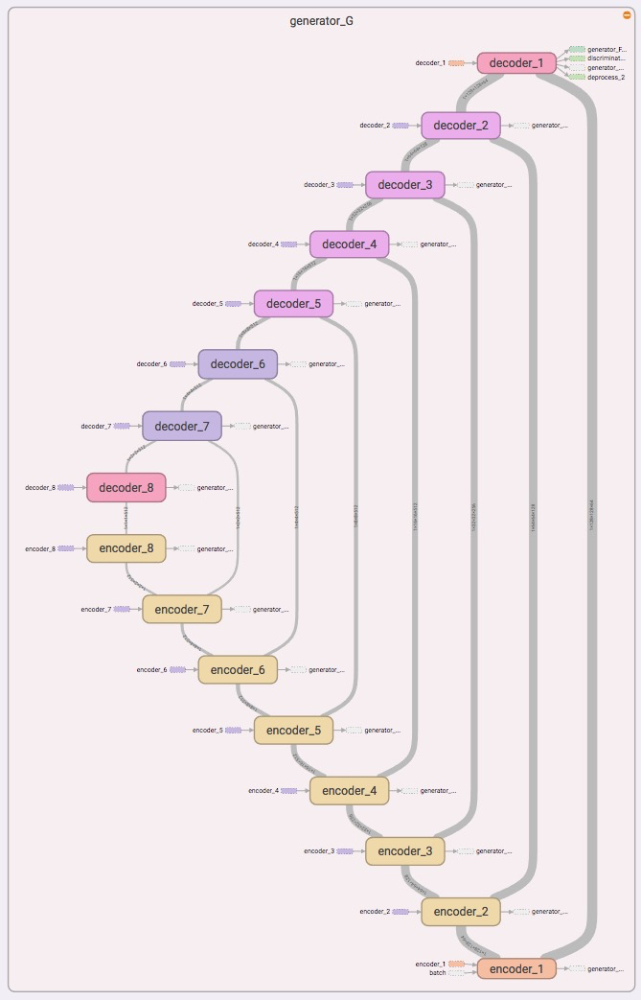
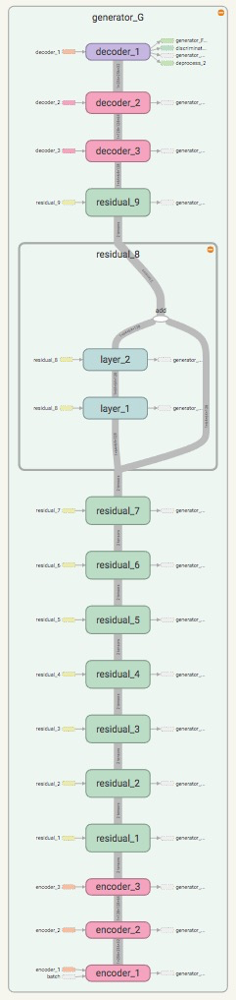

# Results for pix2pix and first CycleGAN

|name|input| pix2pix| CycleGAN (u-net)| CycleGAN (faststyle-net)|target|
|---|---|---|---|---|---|
|1||||  ||

Notes:

*   These examples are taken during the training (~50 epochs).
*   CycleGAN uses a u-net or faststyle-net generators, log loss and a batch-size of 1
*   Note: CycleGAN has a nice output, but does not map windows labels to windows patterns 

|pix2pix|CycleGAN|
|---|---|
|||

|u-net|faststyle_net|
|---|---|
|||
